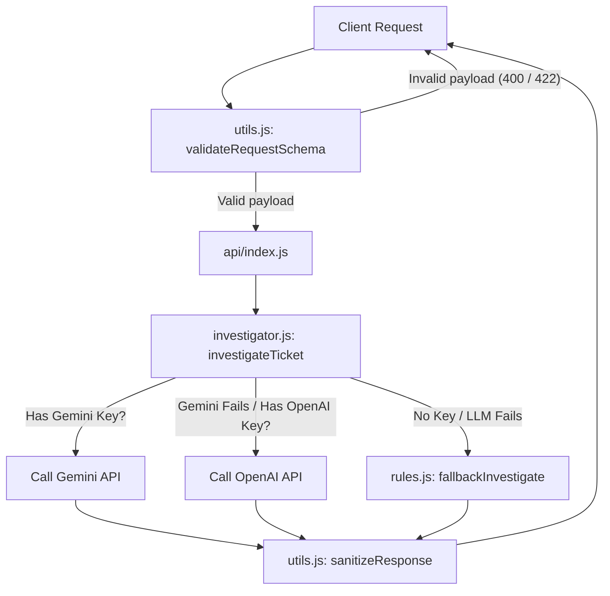

# AI Developer Instructions: QueueStorm Investigator

This file contains technical instructions, architecture notes, and business rules for AI developers (agents, copilots, or code assistants) maintaining or updating this repository.

---

## 🏗️ Codebase Architecture & Flow

The flow of requests in this service is linear and structured:

---

## 📌 Critical Business Rules & Enums

### 1. Schema Enum Values (Case-Sensitive, Must Match Exactly)
Any deviation (case differences, plural forms, or spelling mistakes) will trigger schema violations in evaluation.
- **`evidence_verdict`**: `consistent`, `inconsistent`, `insufficient_data`
- **`case_type`**: `wrong_transfer`, `payment_failed`, `refund_request`, `duplicate_payment`, `merchant_settlement_delay`, `agent_cash_in_issue`, `phishing_or_social_engineering`, `other`
- **`severity`**: `low`, `medium`, `high`, `critical`
- **`department`**: `customer_support`, `dispute_resolution`, `payments_ops`, `merchant_operations`, `agent_operations`, `fraud_risk`

### 2. Department Routing Matrix
- `customer_support`: `other`, low-severity `refund_request`, vague or `insufficient_data` cases.
- `dispute_resolution`: `wrong_transfer`, contested `refund_request`.
- `payments_ops`: `payment_failed`, `duplicate_payment`.
- `merchant_operations`: `merchant_settlement_delay`, merchant side complaints.
- `agent_operations`: `agent_cash_in_issue`, agent side complaints.
- `fraud_risk`: `phishing_or_social_engineering`, suspicious activity patterns.

---

## 🛡️ Programmatic Safety Firewall

The file `src/utils.js#sanitizeResponse` serves as a mandatory processing step for all outputs:
- **PIN/OTP Requests:** Checked via regex `/(?:ask|give|send|share|provide|tell|input|enter|write|verify|confirm)\s+(?:us\s+)?(?:your\s+)?(?:pin|otp|password|cvv|passcode|secret\s*key|card\s*number)/i`. Redacts if matched.
- **Refund Promises:** Checked via regex `/(?:refund(?:ed)?\s+you|we\s+will\s+refund|refund\s+is\s+confirmed|money\s+will\s+be\s+refunded|reversal?\s+(?:is|has\s+been)\s+(?:completed|confirmed|done)|will\s+reverse|account\s+(?:is|has\s+been)\s+(?:unblocked|recovered|activated|restored))/i`. Replaces with safe wording.
- **External Redirects:** Checked via regex that strips non-official links (allowing only `bkash.com` and `sust.edu`) and redacts external phone numbers (allowing only `16247`).

---

## 🛠️ How to Extend or Maintain the Code

### 1. Adding a New Case Type
To add a new case classification:
1. Add the enum value to `allowed_enums.case_type` in `SUST_Preli_Sample_Cases.json` (for local validation) and the system instruction in `src/prompt.js`.
2. Add keywords for keyword matching to `src/rules.js#fallbackInvestigate`.
3. Map the new `case_type` to its corresponding `department` in the routing condition in `src/rules.js` and `src/prompt.js`.

### 2. Updating Prompt Directives
If safety rubrics change:
- Modify `SYSTEM_INSTRUCTION` in `src/prompt.js`.
- Always verify that the system instruction explicitly forces JSON output and instructs models to output ONLY JSON.

---

## ⚠️ Guidelines for AI Editors
- **No Heavy SDKs:** Do NOT introduce official SDKs like `@google/genai` or `openai` if native `fetch` can do the job. This keeps serverless functions small (under Vercel's limits) and minimizes cold-start overhead.
- **CommonJS vs ES Modules:** The codebase is configured as `"type": "module"`. Use standard ES imports (`import ... from '...'`). Always include file extensions in imports (e.g. `import { x } from './utils.js'`).
- **Error Boundaries:** Never expose `err.stack` or raw api response payloads in any HTTP response. Always return a generic error message `{"error": "Internal Server Error"}` with HTTP 500 status.
